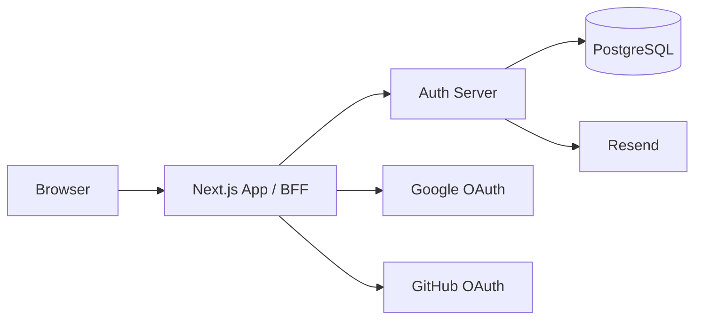
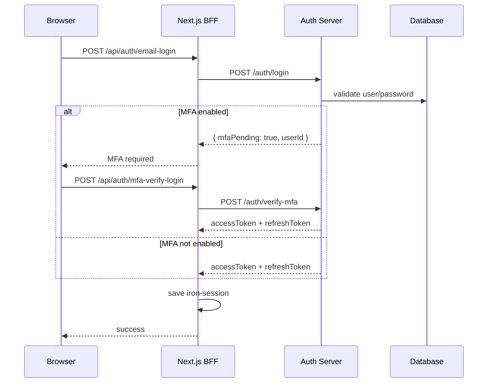
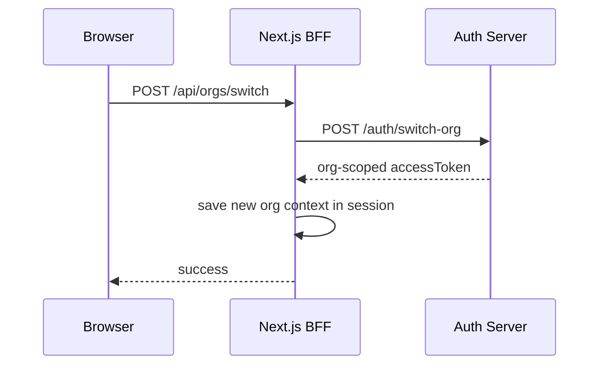

# Vaultly

Vaultly is a production-oriented, multi-tenant authentication and access management system built from scratch without using Auth.js, Clerk, Passport, or any hosted identity provider.

The point of the project was not just to make login work. The goal was to understand and implement the hard parts of modern auth directly:

- RS256 JWT issuance and verification
- refresh token rotation with reuse detection
- OAuth 2.0 / OIDC social login flows
- TOTP MFA
- org-scoped RBAC and tenant isolation
- a Next.js BFF pattern that works with App Router and Server Components

This is a portfolio project designed to demonstrate staff-level reasoning about authentication systems, system boundaries, security tradeoffs, and full-stack architecture.

## What Vaultly does

Vaultly acts like a lightweight CIAM / org access platform for a SaaS product:

- users can register with email/password
- users can sign in with Google or GitHub
- users can create organizations
- admins can invite users into organizations with role-based access
- users can switch org context and receive a fresh org-scoped JWT
- email/password users can enable TOTP MFA
- auth activity is written to an audit log

## Tech stack

### Frontend / BFF

- Next.js 16 App Router
- React 19
- TypeScript
- iron-session
- Tailwind CSS v4

### Auth server

- Node.js
- Express
- TypeScript
- PostgreSQL
- Drizzle ORM
- otplib
- Resend

### Security / identity

- RS256 JWTs
- OAuth 2.0 Authorization Code flow
- PKCE for Google
- TOTP MFA
- refresh token rotation and theft detection

## Monorepo structure

```text
much-auth/
├── auth-server/   # identity service, JWT issuer, RBAC, org routes, MFA, audit
└── my-app/        # Next.js app + BFF routes + UI
```

## Architecture



### Why a BFF?

The browser never talks directly to the auth server for application auth flows.

Instead, the browser talks to Next.js Route Handlers, and those handlers talk to the auth server. This gives a few benefits:

- the auth server URL stays server-side
- tokens can be stored in `httpOnly` session state
- Next.js can mediate refresh, reissue, MFA completion, and org switching
- this works around the fact that Server Components cannot write cookies

## Core capabilities

### 1. Email/password auth

- users register through the Next.js app
- passwords are hashed with bcrypt using cost factor 12
- login uses a timing-safe comparison pattern to reduce email enumeration and timing side-channel risk

### 2. Social login

- Google OAuth 2.0 with Authorization Code + PKCE
- GitHub OAuth Authorization Code flow
- successful social logins are upserted into the local user table
- social users are then issued the same RS256 JWT format as email/password users

That means all downstream auth logic stays consistent regardless of login provider.

### 3. RS256 JWTs + JWKS

- access tokens are signed with an RSA private key
- verification uses the corresponding public key
- the auth server exposes a JWKS endpoint
- OIDC-style discovery metadata is also exposed

Current token claims include org context and role context such as:

- `sub`
- `email`
- `roles`
- `org_id`
- `org_slug`
- `iss`
- `aud`
- `jti`

### 4. Refresh token rotation

Vaultly implements rotating refresh tokens with reuse detection.

- each refresh token belongs to a token family
- every refresh rotates to a brand new refresh token
- reused refresh tokens revoke the full family
- the Next.js app stores refresh tokens inside `iron-session`
- a client-side `TokenRefresher` refreshes access tokens before expiry

This is one of the most important production-style features in the project because it addresses token theft rather than just token expiry.

### 5. TOTP MFA

- email/password users can enable MFA
- setup generates a TOTP secret and QR code
- first successful TOTP verification activates MFA
- later login attempts require the password step plus a TOTP step
- social users are intentionally handled differently and shown that MFA is managed by their provider

### 6. Multi-tenancy and organization context

Vaultly is multi-tenant.

- users can belong to multiple organizations
- each org membership has a role
- switching orgs issues a new JWT scoped to that target org
- org-scoped pages validate token org context before rendering data

This was one of the most interesting parts of the project because multi-org membership introduces token staleness and org-context drift if you do not actively re-scope tokens.

### 7. RBAC

Current roles:

- `admin`
- `member`
- `viewer`

Permissions are enforced on the auth server with middleware. Frontend restrictions are only convenience UX; the server remains the source of truth.

Recent role-guard rules also prevent:

- self-role changes
- demoting the last remaining admin in an org

### 8. Invite flow

- admins can invite users by email
- invite tokens expire after 48 hours
- invites are tied to the invited email address
- accepting an invite updates org membership and refreshes org-scoped session state

### 9. Audit log

Vaultly records key security and org events, including flows like:

- login
- failed login
- MFA verification failure
- MFA enabled
- org created
- invite actions
- role changes
- token reuse detection

## Key engineering decisions

### Why RS256 instead of HS256?

RS256 separates signing from verification.

- only the auth server needs the private key
- any downstream service can verify with the public key
- this scales better than sharing one symmetric secret everywhere

### Why not use Auth.js or Clerk?

Because the value of this project is the implementation itself.

I wanted to understand the protocol-level and system-level concerns directly instead of depending on abstractions too early.

That includes:

- PKCE state management
- refresh rotation
- org-scoped token reissue
- BFF session persistence
- MFA bootstrapping and verification

### Why use iron-session if JWTs already exist?

The JWT is the access token for the auth system.

The iron-session cookie is the application session envelope for the Next.js app. It stores:

- access token
- refresh token
- provider context
- temporary OAuth state during PKCE flows
- temporary MFA pending state

This hybrid approach fits Next.js App Router very well.

### Why is token reissue/switching necessary?

JWTs are snapshots.

Once issued, they do not automatically learn about:

- a newly created org
- a newly accepted invite
- a switched active org
- changed roles

That means the app must explicitly reissue or switch token context after state changes.

## Interesting problems solved during the build

### Server Components cannot write cookies

In Next.js App Router, Server Components can read session state but cannot mutate cookies.

That forced an architecture where stale-token detection in pages redirects through Route Handlers that can write the updated session before redirecting back.

### Multi-org users break naive token assumptions

Once a user belongs to multiple orgs, generic token reissue can return the wrong membership context if the target org is not explicit.

This project now switches token scope deliberately after org creation and org switching.

### Refresh tokens in a BFF are different from browser-only auth

The auth server can set a refresh cookie, but if the browser never receives that response directly, the BFF must persist the refresh token itself. That changed the refresh design significantly.

## Current auth flow summary

### Email/password + MFA



### Org switching



## Local setup

### Prerequisites

- Node.js 20+
- pnpm
- Docker

### 1. Install dependencies

From the repo root:

```bash
pnpm install
```

### 2. Start PostgreSQL

```bash
docker run --name auth-postgres \
  -e POSTGRES_USER=authuser \
  -e POSTGRES_PASSWORD=authpass \
  -e POSTGRES_DB=authdb \
  -p 5432:5432 -d postgres:16
```

### 3. Configure auth server

```bash
cd auth-server
cp .env.example .env
mkdir -p keys
openssl genrsa -out keys/private.pem 2048
openssl rsa -in keys/private.pem -pubout -out keys/public.pem
```

Run the dev server:

```bash
pnpm dev
```

### 4. Configure Next.js app

```bash
cd my-app
cp .env.local.example .env.local
pnpm dev
```

Open:

```text
http://localhost:3000
```

## Environment notes

The project relies on environment variables for:

- DB connection
- JWT key paths / key material
- OAuth provider credentials
- session secret
- app URLs
- Resend API key

See the example env files in:

- `auth-server/.env.example`
- `my-app/.env.local.example`

## What is intentionally not finished yet

This project is production-oriented, but not pretending to be Auth0.

Things I would still harden before calling it truly production-ready:

- rate limiting and abuse controls
- MFA secret encryption at rest
- DB unique constraint on org membership (`organization_id`, `user_id`)
- structured logging and monitoring
- broader integration test coverage
- deployment docs and rollback process

## Why this project matters

Vaultly demonstrates more than UI skill.

It shows the ability to:

- design system boundaries between frontend and auth service
- reason about token lifecycles and stale identity state
- model org-scoped permissions
- implement secure auth flows directly
- debug real auth edge cases instead of hiding them behind libraries

## Suggested demo flow

If you are reviewing the project, the best end-to-end demo is:

1. register a user
2. create an organization
3. invite another user
4. accept the invite in a second session
5. switch org context
6. enable MFA
7. sign out and complete MFA login
8. change a member role as admin
9. verify self-role and last-admin protection
10. inspect the audit log

## Future expansion ideas

- recovery codes for MFA
- device/session management UI
- SAML / enterprise SSO
- SCIM provisioning
- stronger secrets management for the mock vault area
- admin analytics and security alerting

## License

This project is for learning, portfolio, and architecture demonstration.
